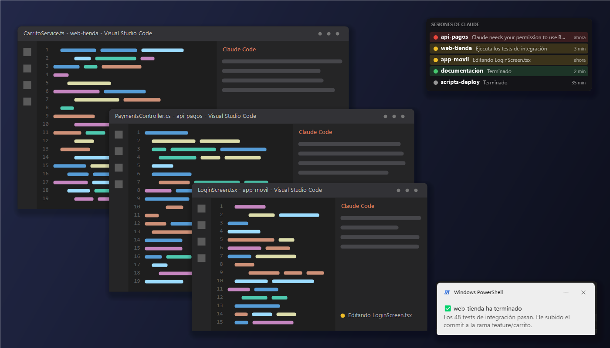
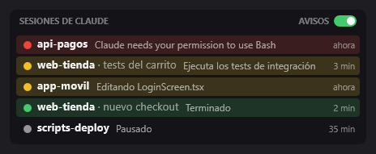
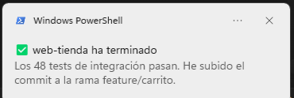
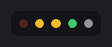

<div align="center">

# Claude Monitoring para Rainmeter

**Todas tus sesiones de Claude Code, en un vistazo.**<br>
Un panel discreto en el escritorio que te dice qué agente está trabajando, cuál ha terminado y cuál te está esperando.

[](https://github.com/Dasge97/claude-monitoring-rainmeter/commits/main)
[](#instalación)
[](https://docs.anthropic.com/en/docs/claude-code)
[](https://www.rainmeter.net)
[](https://nodejs.org)
[](#instalación)
[](https://github.com/Dasge97/claude-monitoring-rainmeter/commits/main)



[](#instalación)
&nbsp;
[](docs/como-funciona.md)

</div>

---

## ¿Trabajas con varios agentes a la vez?

Tienes tres o cuatro ventanas de VS Code abiertas, cada una con Claude Code haciendo algo.
Y te pasas el día saltando entre ellas para ver cuál ha terminado, cuál se ha quedado esperando
un permiso desde hace diez minutos y cuál sigue trabajando.

**Claude Monitoring te lo dice sin que tengas que mirar.**

## Lo que hace

🚦 **Un semáforo por sesión.** Amarillo si está trabajando, rojo si te necesita, verde si ha terminado.

👀 **Qué está haciendo, en directo.** El comando que ejecuta, el fichero que edita o la pregunta que te hace.

🔴 **Lo urgente, arriba.** Las sesiones que te esperan suben las primeras y parpadean hasta que las atiendes.

🔔 **Te avisa cuando acaba o te necesita.** Notificación de Windows con tu propio sonido, uno distinto para cada caso.
Y no te molesta si ya estás mirando esa ventana.

🖱️ **Un clic y estás allí.** Pulsa una fila o una notificación y se pone delante la ventana de VS Code de esa sesión.

🪶 **Discreto.** Semitransparente, siempre encima y opaco solo cuando pasas el ratón.
Con un modo mínimo que se queda en una fila de puntos.

🧹 **Se limpia solo.** Cierras una ventana de VS Code y sus sesiones desaparecen del panel.

⚙️ **Sin configurar nada en cada sesión.** Funciona con todas tus sesiones, en todos tus proyectos, desde que lo instalas.

<div align="center">
<table>
<tr>
<td align="center"><br><sub>Modo completo</sub></td>
<td align="center"><br><sub>Aviso al terminar, con el último mensaje de Claude</sub></td>
<td align="center"><br><sub>Modo mínimo</sub></td>
</tr>
</table>
</div>

## El semáforo

| | Estado | Cuándo |
|:-:|---|---|
| 🔴 | **Te necesita** | Pide permiso para una herramienta, te hace una pregunta o tiene un plan para que lo revises. Parpadea. |
| 🟡 | **Trabajando** | Está pensando o usando una herramienta. |
| 🟢 | **Ha terminado** | Acaba de responder. Se queda en verde 10 minutos. |
| ⚪ | **En espera** | Sesión abierta sin actividad reciente. |

## Instalación

```powershell
git clone https://github.com/Dasge97/claude-monitoring-rainmeter.git
```

Y **doble clic en `Instalar.cmd`**. Eso es todo.

También vale descargar el repositorio con **Code → Download ZIP**, descomprimirlo y hacer doble clic en `Instalar.cmd`.

> Si te falta [Rainmeter](https://www.rainmeter.net), [Node.js](https://nodejs.org) o
> [Git para Windows](https://git-scm.com/download/win), el instalador los instala por ti.
> Windows te pedirá permiso de administrador para cada uno.

Para actualizar, `git pull` y otra vez doble clic en `Instalar.cmd`. Tus sonidos y tus ajustes se conservan.

## Hazlo tuyo

**🔊 Tus sonidos.** Pon dos ficheros `.wav` en `%USERPROFILE%\.claude\panel-sesiones\sonidos\`:
`terminado.wav` y `necesita.wav`. Sin ellos suena el aviso normal de Windows.
Ideas en [Myinstants](https://www.myinstants.com), [Mixkit](https://mixkit.co/free-sound-effects/) o [Pixabay](https://pixabay.com/sound-effects/).

**📐 Modo completo o mínimo.** Clic en el título del panel, o botón derecho → *Cambiar modo*.

**📍 Donde quieras.** Arrastra el panel a cualquier sitio de la pantalla. Se queda ahí.

## Preguntas frecuentes

<details>
<summary><b>¿Ralentiza a Claude Code?</b></summary>

No se nota. Cada evento lanza un proceso muy corto, de unos 50-60 ms.
Solo los avisos esperan un par de segundos más, mientras suena el sonido.
En ese momento Claude está parado igualmente: ha terminado o está esperando tu permiso.
</details>

<details>
<summary><b>¿Funciona con Claude Code en la terminal?</b></summary>

Sí. El panel y las notificaciones funcionan con cualquier sesión de Claude Code.
Lo único exclusivo de VS Code es el clic para traer su ventana al frente.
</details>

<details>
<summary><b>¿Qué toca de mi sistema?</b></summary>

- Añade unos hooks a `%USERPROFILE%\.claude\settings.json`, sin tocar los que ya tengas. Antes guarda una copia.
- Copia sus ficheros en `%USERPROFILE%\.claude\panel-sesiones`.
- Crea la skin `PanelClaude` en Rainmeter.
- Registra el enlace `panelclaude://` para tu usuario, para que las notificaciones abran la ventana.

Nada se envía fuera de tu PC.
</details>

<details>
<summary><b>¿Cómo lo desinstalo?</b></summary>

Los pasos están en [Cómo funciona por dentro → Desinstalar](docs/como-funciona.md#desinstalar).
</details>

---

<div align="center">

**¿Quieres saber cómo está hecho?**

[](docs/como-funciona.md)

<sub>Hecho para trabajar con varios agentes de Claude Code a la vez sin perder el hilo.</sub>

</div>
